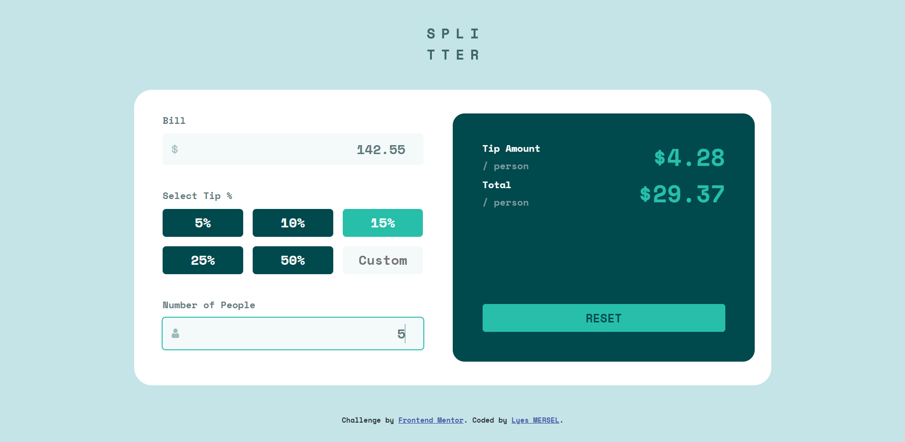

# Frontend_Mentor_Challenge_04
Tip Calculator web-app

# Frontend Mentor - Tip calculator app solution
This is a solution to the [Tip calculator app challenge on Frontend Mentor](https://www.frontendmentor.io/challenges/tip-calculator-app-ugJNGbJUX). Frontend Mentor challenges help you improve your coding skills by building realistic projects

# Screenshot

# Built with
- HTML5
- CSS
- Bootstrap 5.3v
- JS
- Jquery 3

# Author
- Website - [Portfolio](https://lyes-mersel.netlify.app)
- Github - [@lyes-mersel](https://github.com/lyes-mersel)
- Frontend Mentor - [@lyes-mersel](https://www.frontendmentor.io/profile/lyes-mersel)
- LinkedIn - [@lyes-mersel](https://www.linkedin.com/in/lyes-mersel/)

# Made with ❤️